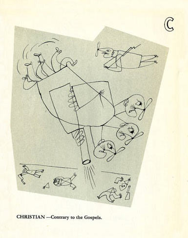

---
title       : L'alphabet du bon citoyen
subtitle    : 
author      : Bertrand Russell
job         : 
framework   : impressjs     # {io2012, html5slides, shower, dzslides, ...}
widgets     : [bootstrap]            # {mathjax, quiz, bootstrap}
mode        : selfcontained # {standalone, draft}
--- x:0 y:0 scale:4


```{r, echo=FALSE}
library(slidify)
parse_body <- function(body){
  html = ifelse(body != '', slidify:::md2html(body), '')
  pat = '^(<h([0-9])>([^\n]*)</h[0-9]>)?\n*(.*)$'
  pat = stringr:::regex(pat, dotall = TRUE, multiline = TRUE)
  body = setNames(as.list(stringr:::str_match(html, pat)),
   c('html', 'header', 'level', 'title', 'content'))
  # body = modifyList(body, parse_content(body$content))
  # HACK: So that landslide h1's with no content are centered
  if (body$content == "" | is.na(body$content)){
    body$content = NULL
  }
  if (body$header == "" | is.na(body$header)){
    body$header = NULL
  }
  return(body)
}
assignInNamespace("parse_body", parse_body, ns="slidify")
# unlink("./.cache", recursive=TRUE)
```

```{r, echo=FALSE, cache=FALSE}
dd <- read.csv("./assets/data/Russell_GoodCitizen.csv", row.names=1)
# 
# dd <- data.frame(
#   lettre=LETTERS[1:3],
#   mot=c("Ânerie", "Bolchévique", "Chrétien"),
#   def=c("Ce que *vous* pensez.", "Quiconque a une opinion différente de la mienne.", 
#         "Contraire aux Évangiles."), 
#   row.names="lettre")
texte <- function(lettre){
  sprintf("<h2><em>%s</em></h2><h3>%s</h3>", dd[lettre,"word_fr"], dd[lettre,"def_fr"])
}
slide <- function(lettre, suffix=letter){
  cat(sprintf("</br>

*** =left


*** =right

%s
", suffix, suffix, texte(lettre)))  
}
```


<span class="try">L'alphabet du bon citoyen</span>
# Bertrand Russell

--- x:3500 y:3100 rot:45 scale:6

</br>

Le 13 décembre 1952, Bertrand Russell adressait son manuscrit de *L'Alphabet du bon citoyen* à Stefan Themerson : *"Ce que je vous envoie n'a pas d'autre but que l'amusement. J'imagine déjà les charmantes illustrations que pourrait dessiner Mrs Themerson."*

--- x:8500 y:4100 rot:180 scale:6

L'éditeur, enthousiasmé, commença à en programmer la publication pour le printemps suivant, et demanda à Russell quelles étaient ses conditions. 

--- x:2825 y:2325 z:-2000 rot:300 scale:1

*"Vous me demandez mes conditions, répondit le philosophe, je comptais vous offrir mon alphabet pour Noël. Si cela vous convient, j'aime autant qu'il en soit ainsi. Je me garderais bien de réclamer des droits d'auteur sur ce qui risque de ne pas être une affaire très rentable."*

--- .cover x:5000 y:3325 z:-4000 rot:180 scale:1


--- x:7000 y:8600 z:-4000 rot:90 scale:12

<p style='width:1000px;font-size:23px;. text-align:center'>
Le présent volume a pour vocation de combler une lacune dont notre système éducatif est entaché de longue date. Les personnes ayant la plus grande expérience des toutes premières étapes du processus pédagogique ont été obligées de conclure que, dans de très nombreux cas, beaucoup de complications inutiles et d'heures de cours gaspillées, alors qu'on aurait pu l'éviter, s'expliquaient par le fait que l'ABC, cette clé de toute sagesse, n'était pas présenté d'une manière assez attrayante pour les esprits immatures à qui nous avons malheureusement le devoir de nous adresser. Cet ouvrage, si restreinte en soit l'étendue et si modeste en soit la visée, répond exactement, nous le croyons et nous l'espérons, au besoin d'édification de l'esprit d'un enfant au stade de l'éveil, confronté aux dangers de notre époque. Ce que nous avançons repose sur des preuves concrètes. Nous avons essayé notre alphabet sur de nombreux sujets. Certains l'ont jugé sage, d'autres stupide. Certains l'ont considéré honnête, d'autres ont pu le trouver subversif. Mais - nous le disons avec la confiance la plus complète et la plus absolue - tous ceux à qui nous avons montré ce livre ont eu, depuis lors, une connaissance impeccable de l'alphabet. C'est pourquoi nous sommes convaincus que, dès la seconde où elles prendront connaissance de cet ouvrage, nos autorités éducatives donneront immédiatement l'ordre de l'adopter dans toutes les institutions scolaires où sont inculqués les premiers éléments d'alphabétisation.</p>

<div align="right" style="font-size:20px"><em>17 janvier 1953, B.R.</em></div>


--- x:10000 y:16600 z:-3000 rot:45 scale:5

<div style='float:left;width:48%;' class='centered'>

</div>
  <div style='float:right;width:48%;'>
`r texte("A")`
</div>


--- #ing x:12000 y:18600 z:-4000 rot:0 scale:4

<div style='float:left;width:48%;' class='centered'>

</div>
  <div style='float:right;width:48%;'>
<h2><em><b class="positioning">Bolchévique</b></em></h2>
<h3>Quiconque a une opinion différente de la mienne.</h3>
</div>


--- #letterc x:13000 y:20500 z:-3500 rot:-20 scale:3

<div style='float:left;width:48%;' class='centered'>

</div>
  <div style='float:right;width:48%;'>
<h2><em><b class="rotating">Chrétien</b></em></h2>
<h3>Contraire aux Évangiles.</h3>
</div>

```{r, echo=FALSE}
unlink("./.cache", recursive=TRUE)
```

